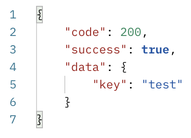

# An Example HTTP Server with AWS Support 

The project is a simple demonstration of a server which is
* able to upload/list/get operations on AWS S3(as a storage),
* containerized with Docker
* serving on AWS EC2 container instances.

The technologies/services used in the project are as follows:
* #### Amazon Web Services ☁️
  * Amazon Elastic  Container Service(ECS)
  * Amazon Elastic  Container Registry(ECR)
  * Amazon Elastic  Compute   Cloud(EC2)
  * Amazon Simple   Storage   Service(S3)
  * Amazon Identity Access    Management(IAM)
* #### GoLang (v1.18) 💻
  * Gin/Gonic HTTP Framework
* #### Docker 📦
* #### GitHub Actions 🚀

- - - -

## AWS Configuration

### AWS IAM

| Type   | Name                                     | Permissions                                                                                                                                                                            |
|--------|------------------------------------------|----------------------------------------------------------------------------------------------------------------------------------------------------------------------------------------|
| Policy | ```S3PicusBucketReadWriteAccessPolicy``` | ```"s3:PutObject"```,```"s3:GetObject"```,```"s3:ListBucket" ```                                                                                                                       |
| Policy | ```ecr-push-policy```                    | ```"ecr:CompleteLayerUpload"```,```"ecr:TagResource"```,```"ecr:UploadLayerPart"```,<br/>```"ecr:InitiateLayerUpload"```,```"ecr:BatchCheckLayerAvailability"```,```"ecr:PutImage" ``` |
| Policy | ```ecs-task-definition-policy```         | ```"ecs:UpdateService"```,```"ecs:DescribeServices"```,```"ecs:RegisterTaskDefinition"```,<br/>```"ecs:DescribeTaskDefinition"```                                                      |
| Policy | ```iam-pass-policy```                    | ```"iam:PassRole" ```                                                                                                                                                                  |
| Role   | ```github-actions-role```                | ```S3PicusBucketReadWriteAccessPolicy```                                                                                                                                               |
| Role   | ```ecs-task-role```                      | ```S3PicusBucketReadWriteAccessPolicy```, ```AmazonECSTaskExecutionRolePolicy```, ```ecr-push-policy```,<br/> ```ecs-task-definition-policy```, ```iam-pass-policy```                  |

### AWS Network&Security

#### AWS Security Group

Following inbound rules defined: 

| IP Version | Type  | Protocol | Port | Source                    |
|------------|-------|----------|------|---------------------------|
| IPv4       | HTTP  | TCP      | 80   | Any(0.0.0.0/0)            |
| IPv4       | HTTPS | TCP      | 443  | Any(0.0.0.0/0)            |
| IPv4       | SSH   | TCP      | 22   | Only me from my ip adress |

#### AWS Target Group

* Health check path is /ping
* Registered target is created ECS Cluster

#### AWS Application Load Balancer

* Registered listener so that forward requests(HTTP, port 80) to above target group 

- - - -

## Structure of the Project

### Github/Workflows 🚀
Contains CI/CD pipelines.

#### CI Part
* Runs on changes in ```main``` branch via push/pull requests
* Builds and runs ```vet&lint``` tools
* Gets ```github-actions-role``` AWS IAM role for 900 seconds(minimum duration to get a role) since tests are connecting to S3 bucket
* Runs test for all endpoints 

#### CD Part
* Runs only on successful completion of ```CI``` part
* Gets ```ecs-task-role``` AWS IAM role for 900 seconds
* Builds the Docker container and pushes it to ECR
* Downloads the task definition json(Since this file contains bucket name and some arns, I don't want to store it in repository.)
* Deploy to AWS ECS

#### Final CI/CD Diagram


### Server App(GO) 💻
* Tests are not using a mock client, they are connecting the actual S3 bucket as well. 

#### Config
* Contains server ```host/port``` info along with ```S3 bucket name```.
* ```Viper``` package used for reading config.

#### Core
* ```App``` package contains the implemented endpoints(ListObjects, SaveObject, GetObject) according to GoLang structure.
* ```Aws``` package contains ```S3 Service Client``` to provide a wrapper to S3 operations along with necessary models.
* ```Response``` package is for providing generic responses to user.
* ```Server``` package is for initalizing and running http server.

### Docker 📦
* Repository contains ```Dockerfile``` to containerize app and ```.dockerignore``` file to prevent some directories copied into docker image.

- - - -

## Running On Localhost 🏠
Set the necessary environment variables firstly(if you are using AWS User, no need to give session token; if you assumed a role, it should be given),

    AWS_ACCESS_KEY_ID
    AWS_SECRET_ACCESS_KEY
    AWS_SESSION_TOKEN
    AWS_REGION
    AWS_S3_BUCKET_NAME

- [x] Clone this repository & Install Docker
- [x] Change directory to here
- [x] ```docker build --tag server-with-aws .``` to build the image
- [x] ```docker run --publish 8080:8080 server-with-aws``` to run image as a container

## Example Requests/Responses 👀
You can also try endpoints via postman by importing ```postman_collection.json```(AWS services might be closed, so host might not be reachable).  

| Requests                          | Responses                                  |
|-----------------------------------|--------------------------------------------|
|          |          |
|           |           |
|            |            |
|  |  |


## Final Architecture


